# Purpose

This is the root README for my Data Science practical, student number
24991422. It collates the four questions, each of which lives in its own
folder and works on a standalone basis. The point of this file is to
source each question’s functions from its `code/` folder and render the
key figures and tables here, so the whole submission can be read and
checked from one place.

The workflow is the same throughout. Every operation is written as a
function, one per file, kept in that question’s `code/` folder and
sourced together at the top of each section. The data sits in each
question’s `data/` folder and is not tracked by the repository, so the
chunks below expect the files to be in place before the README knits.

### How to get started

I set the project up with the following, which creates the repository
and the Texevier templates for the three written questions. Question 1
is an `officer` PowerPoint deck rather than a Texevier document, so it
has no template.

``` r
CHOSEN_LOCATION <- "~/DataScience/Practical/"
fmxdat::make_project(FilePath = glue::glue("{CHOSEN_LOCATION}Solution/"), ProjNam = "24991422")

Texevier::create_template(directory = glue::glue("{CHOSEN_LOCATION}Solution/24991422/"), template_name = "Question2")
Texevier::create_template(directory = glue::glue("{CHOSEN_LOCATION}Solution/24991422/"), template_name = "Question3")
Texevier::create_template(directory = glue::glue("{CHOSEN_LOCATION}Solution/24991422/"), template_name = "Question4")
```

# Question 1, Coffee

A recommendation deck for stocking the Neelsie Coffee Hub, built in R
with `officer` so the slides regenerate from the data. The deck itself
is `Question1/Coffee_Hub_Recommendation.pptx`, and the charts inside it
come from the functions sourced below. I reproduce them here from the
same prepared data the deck uses.

My approach is to let the supplied reviews drive every claim so that
nothing is hand-picked. `load_coffee` reads and cleans the file,
`region_from_origin` rolls scattered growing regions up to countries,
and `derive_keywords` ranks review words by the rating lift they carry
rather than by a list I chose, after which `score_keywords` tags each
coffee on those words. The four plots then turn that one prepared table
into the roast, region-value, flavour and supplier views the deck
recommends from, so each slide traces back to a number in the data.

``` r
list.files('Question1/code/', full.names = T, recursive = T) %>% .[grepl('.R', .)] %>% as.list() %>% walk(~source(.))

Coffee <- load_coffee("Question1/data/Coffee/Coffee.csv") %>% # load and fix the strange characters
    filter(Cost_Per_100g > 0) %>% # drop the odd zero-cost rows
    mutate(desc_all = replace_na(desc_all, "")) # a couple of reviews are missing

# roll growing regions up to countries
region_lookup <- c("Ethiopia"="Ethiopia","Kenya"="Kenya","Colombia"="Colombia","Panama"="Panama", "Hawai"="Hawaii","Guatemala"="Guatemala","Sumatra|Lintong|Sulawesi|Indonesia"="Indonesia", "Costa Rica"="Costa Rica","Brazil"="Brazil","Honduras"="Honduras","Rwanda"="Rwanda")

Coffee <- region_from_origin(Coffee, region_lookup) # tag each coffee's region
keywords <- derive_keywords(Coffee, n = 12) # indicator words, straight from the reviews
Coffee <- score_keywords(Coffee, keywords) # score each coffee on those words
```

Grouping every coffee by roast level and averaging the rating sets the
roast strategy. The lighter roasts come out on top, with light and
medium-light scoring highest and the rating sliding as the roast
darkens, so the range should be built on lighter roasts.

``` r
plot_roast(Coffee)
```

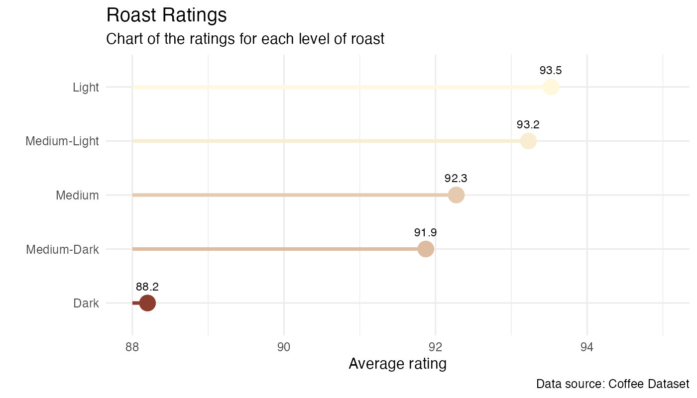

Each growing country sits here by its average rating against its average
price per 100g. East African origins like Kenya and Ethiopia land within
a point of Panama while costing a fraction as much, and that gap is the
core sourcing argument.

``` r
plot_origin_map(Coffee)
```

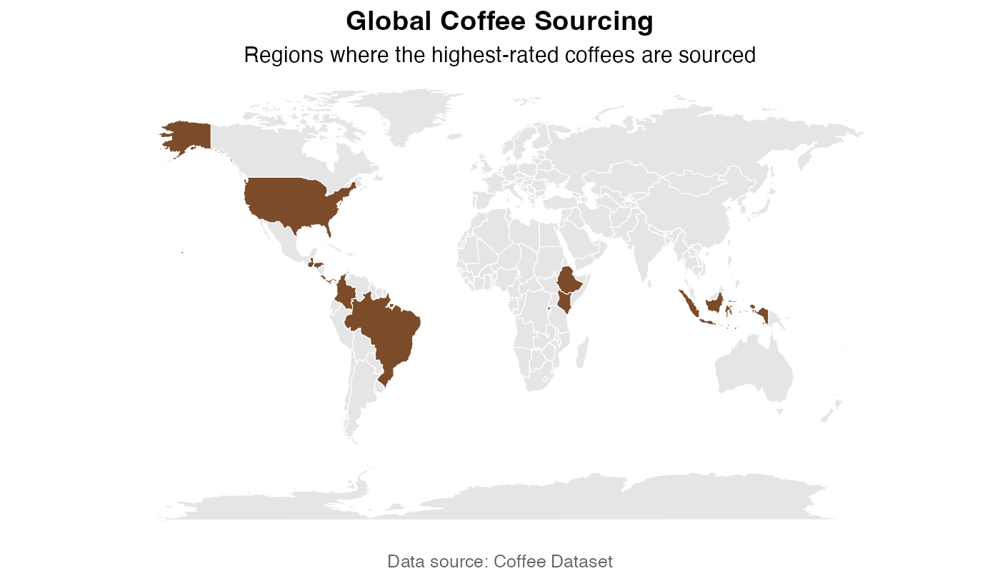

``` r
plot_region_value(Coffee)
```

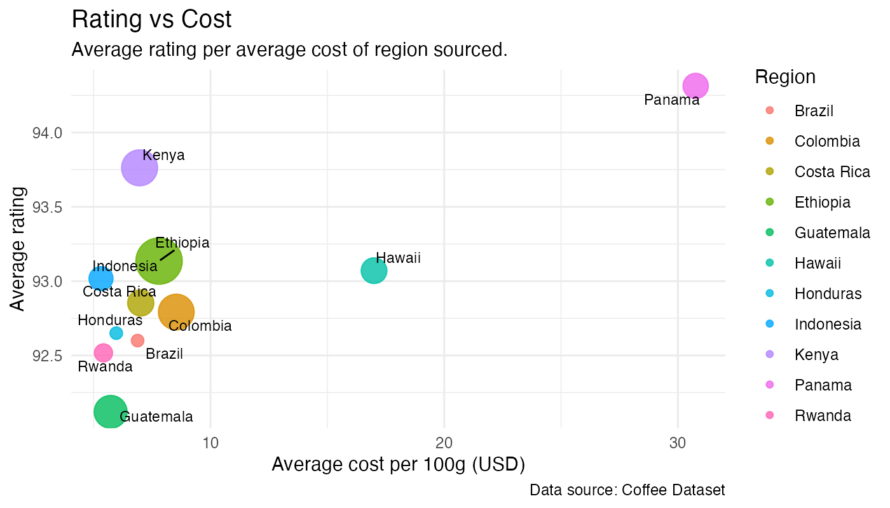

The fingerprint weighs how often each data-derived flavour word turns up
in the best coffees against the shelf as a whole. Words like juicy and
saturated are far more common among top-rated coffees, which marks them
out as the notes worth stocking towards.

``` r
plot_flavour_fingerprint(Coffee, keywords)
```

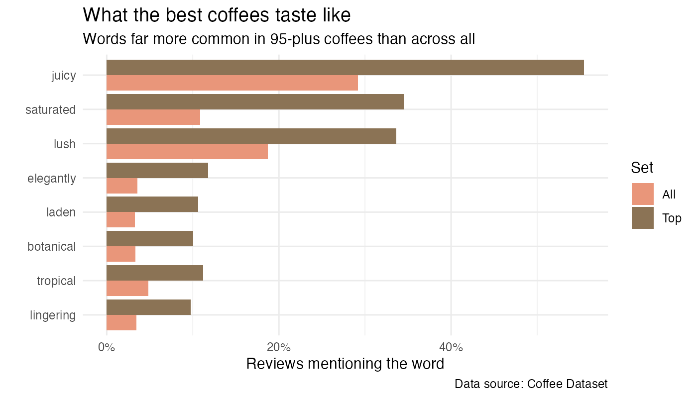

Ranking suppliers by their average rating pulls the affordable apart
from the premium. A handful of roasters deliver high quality at low cost
while a separate group holds the top of the price range, so the shelf
can carry both a value tier and a showpiece tier.

``` r
plot_supplier_leaderboard(Coffee)
```

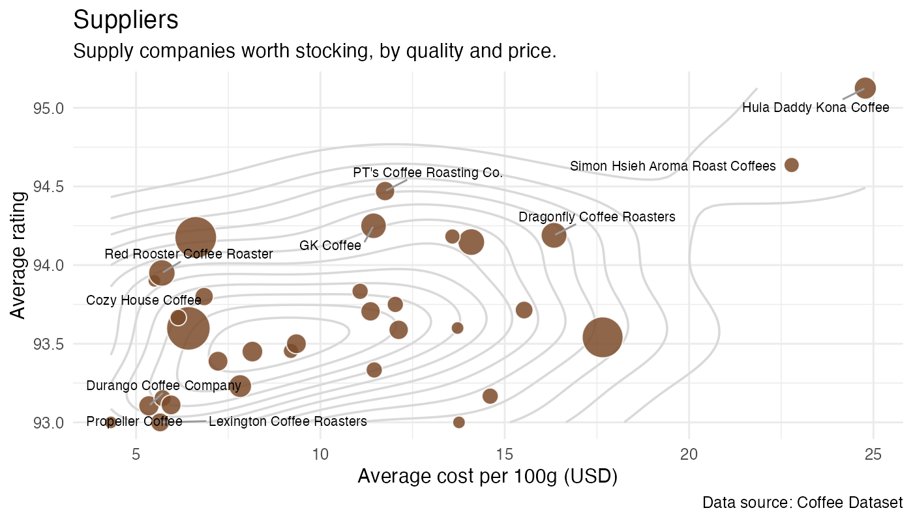

# Question 2, Baby Names

How American culture writes itself into a cradle, read from the full
state record of births from 1910 to 2014. The functions collate the
national counts, measure how long the top names persist, then test music
and screen against the surges directly using the Billboard and HBO
datasets.

My approach splits the question into persistence and surges.
`collate_names` and `national_totals` build the national series,
`name_persistence` and `persistence_table` measure how firmly each
year’s top names hold their rank over the following years, and
`find_spikes` pulls the sharp year-on-year jumps straight from the data.
To test cause rather than assert it, `billboard_name_spikes` and
`hbo_name_spikes` match those jumps against the Billboard and HBO
datasets, `combine_matches` and `tag_spike_source` label each surge by
what drove it, and `plot_event_study` pools the matches to read the
average naming response around an event.

``` r
list.files('Question2/code/', full.names = T, recursive = T) %>% .[grepl('.R', .)] %>% as.list() %>% walk(~source(.))

nat <- collate_names("Question2/data/US_Baby_names/Baby_Names_By_US_State.rds") # national name counts

tot <- national_totals(nat) # collapsed across gender

charts <- read_rds("Question2/data/US_Baby_names/charts.rds") # weekly Billboard Hot 100

titles <- read_rds("Question2/data/US_Baby_names/HBO_titles.rds") # HBO titles and scores

credits <- read_rds("Question2/data/US_Baby_names/HBO_credits.rds") # HBO cast and characters

pers <- bind_rows(name_persistence(nat, "M"), name_persistence(nat, "F")) # persistence series

ptab <- persistence_table(pers) # summary table

spikes <- find_spikes(nat) # data-driven year-on-year surges

bb <- billboard_name_spikes(nat, charts) # singer-driven names

hbo <- hbo_name_spikes(nat, titles, credits) %>% # character-driven names
    mutate(across(where(is.character), ~ iconv(., to = "UTF-8", sub = ""))) # drop invalid bytes

matches <- combine_matches(bb, hbo) # names driven by both

sourced <- tag_spike_source(spikes, bb, hbo) # surges labelled by cause

fade_names <- spikes %>% 
    filter(Count >= 2000) %>% 
    slice_max(Growth, n = 6) %>% 
    pull(Name)

dist_names <- tot %>% 
    group_by(Name) %>%
    summarise(peak = max(Count), last = Count[which.max(Year)], .groups = "drop") %>%
    filter(peak >= 10000, last < 0.12 * peak) %>% 
    slice_max(peak, n = 6) %>%
    pull(Name)

bb_events  <- bb  %>% 
    slice_max(Ratio, n = 5) %>% 
    transmute(Name, Event_Year = Chart_Year)

hbo_events <- hbo %>% 
    slice_max(Ratio, n = 5) %>% 
    transmute(Name, Event_Year = release_year)
ev_events  <- matches %>% transmute(Name, Event_Year, Source)
```

For every year, the 25 most popular names are followed one, two and
three years on, and the rank correlation is drawn by gender. The top
names hold their position firmly through most of the century before
loosening after 1990, and that loosening runs sharper for boys than for
girls.

``` r
plot_persistence(pers)
```

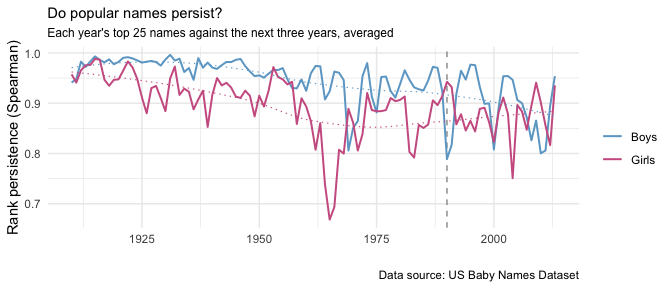

``` r
ptab %>% 
    kable(caption = "Mean rank persistence by gender and horizon, before and from 1990",
               digits = 3, col.names = c("Gender", "Horizon", "Pre-1990", "1990 onward", "Change"))
```

| Gender | Horizon | Pre-1990 | 1990 onward | Change |
|:-------|:--------|---------:|------------:|-------:|
| Boys   | 1-year  |    0.981 |       0.950 | -0.031 |
| Boys   | 2-year  |    0.958 |       0.891 | -0.067 |
| Boys   | 3-year  |    0.934 |       0.836 | -0.098 |
| Girls  | 1-year  |    0.952 |       0.937 | -0.014 |
| Girls  | 2-year  |    0.900 |       0.868 | -0.032 |
| Girls  | 3-year  |    0.853 |       0.815 | -0.038 |

Mean rank persistence by gender and horizon, before and from 1990

Mapping the share of births that open with each letter across the
decades turns the alphabet itself into a fashion chart. Whole rows
brighten and fade as initials move in and out of favour, so the churn
that drives names runs right down to the single opening letter.

``` r
plot_initial_heat(tot)
```

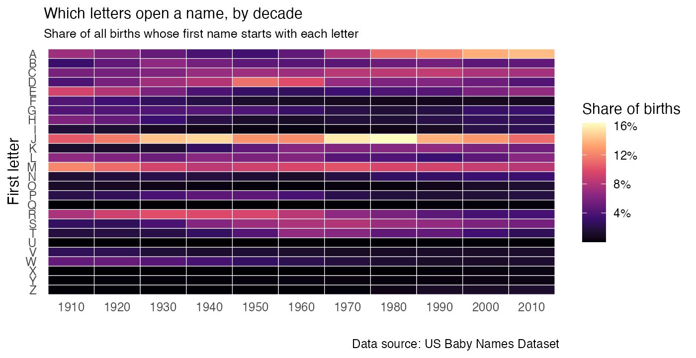

Stacking the distribution of name length for each decade, weighted by
births, gives one ridge per generation. The weighted mean climbs from
about 5.7 letters mid-century to roughly 6.2 in the 1980s and 1990s and
then eases back toward 5.9, so the long name was a late-century fashion
rather than a lasting change.

``` r
plot_length_ridges(nat)
```

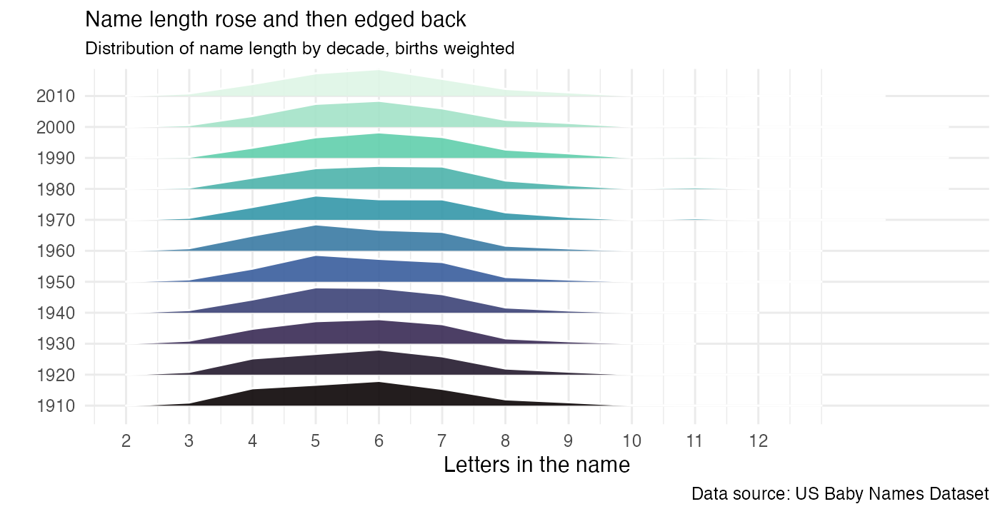

Here are the ten sharpest year-on-year surges, each tagged with the
cause the datasets can attribute. The biggest movements are sudden
spikes rather than slow drifts, and most of them line up with a song or
a screen character.

``` r
sourced %>%
    slice_max(Growth, n = 10) %>%
    transmute(Year, Name, Before = Prev, After = Count, `Times bigger` = round(Growth, 1), Cause = Source) %>%
    kable(caption = "The ten sharpest year-on-year name surges, with the cause our datasets can attribute")
```

| Year | Name     | Before | After | Times bigger | Cause |
|-----:|:---------|-------:|------:|-------------:|:------|
| 1972 | Katina   |     48 |  2726 |         56.8 | Other |
| 1983 | Marquita |     96 |  2522 |         26.3 | Other |
| 1966 | Audra    |     36 |   865 |         24.0 | Other |
| 1976 | Farrah   |     36 |   813 |         22.6 | Other |
| 1912 | Woodrow  |     82 |  1826 |         22.3 | Other |
| 2001 | Nevaeh   |     53 |  1179 |         22.2 | Other |
| 1957 | Tammy    |    204 |  4363 |         21.4 | Other |
| 1954 | Sheree   |     35 |   646 |         18.5 | Other |
| 1992 | Devante  |     86 |  1551 |         18.0 | Other |
| 1994 | Aliyah   |     43 |   707 |         16.4 | Other |

The ten sharpest year-on-year name surges, with the cause our datasets
can attribute

Every culturally driven name is placed by the year it surged, sized by
the babies it reached at the peak and coloured by whether a singer or a
character drove it. The surges cluster in the music and television era,
and both sources throw up names that climb into the thousands.

``` r
plot_spike_bubble(matches)
```

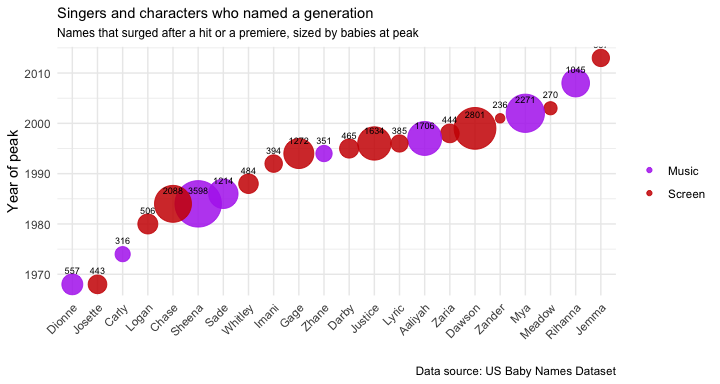

Following the sharpest surges across their whole life, rather than
freezing them at the peak, tells a blunter story. Almost all of them are
short-lived fashions that climb fast and fade inside a decade.

``` r
plot_trajectories(tot, fade_names, title = "Fade or stick", subtitle = "The sharpest surges are usually short-lived fashions")
```

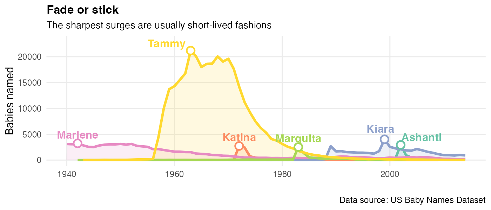

This plot rescales the biggest names of the century to their own peak so
the full arc is visible. It shows that even the largest names eventually
fall to a fraction of their height, so size at the top is no guarantee
of staying power.

``` r
plot_name_distribution(tot, dist_names)
```

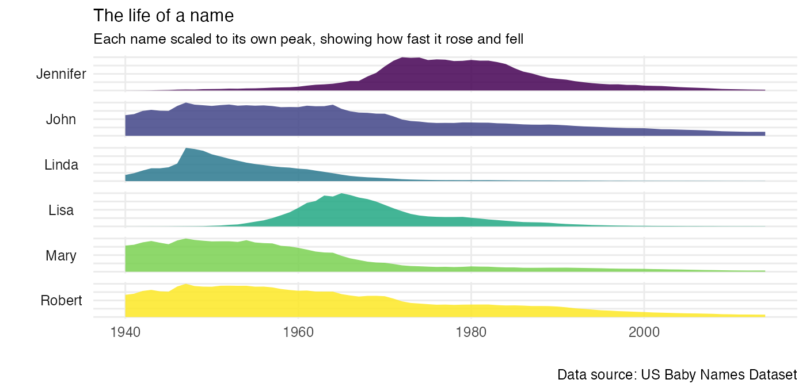

Tracking the share of babies who carry one of the ten most popular names
each year, fitted with a straight trend, measures how thinly naming is
spread. The concentration falls from about nineteen percent in 1910 to
under six percent by 2014, so the top names now command a far smaller
slice of each cohort.

``` r
plot_name_concentration(tot)
```

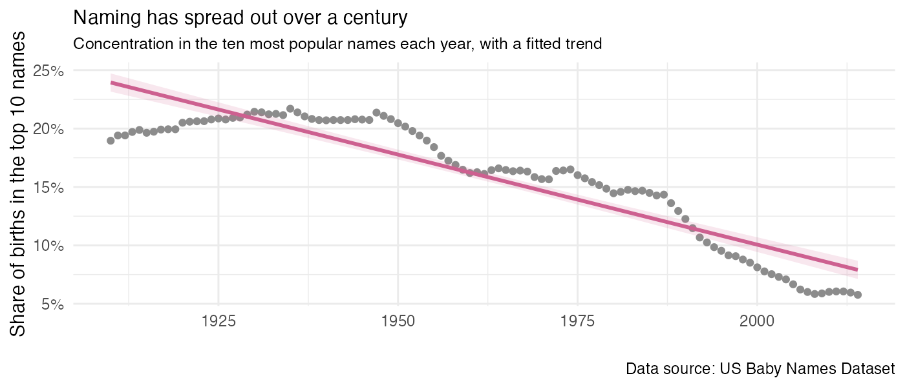

This is the roll of singers whose first name jumped in newborns once
they first cracked the Billboard top ten. The chart all but manufactures
names here, with Sade and Rihanna climbing from almost nothing into the
thousands.

``` r
bb %>% 
    slice_max(Ratio, n = 8) %>%
    transmute(Name, Artist = artist, `First charted` = Chart_Year, Before = Pre, Peak = Post, `Times bigger` = Ratio) %>%
    kable(caption = "Singers whose first name surged in babies after they first reached the Billboard top ten")
```

| Name    | Artist         | First charted | Before | Peak | Times bigger |
|:--------|:---------------|--------------:|-------:|-----:|-------------:|
| Sade    | Sade           |          1985 |      0 | 1214 |       1214.0 |
| Rihanna | Rihanna        |          2005 |      0 | 1045 |       1045.0 |
| Zhane   | Zhane          |          1993 |      0 |  351 |        351.0 |
| Aaliyah | Aaliyah        |          1994 |      5 | 1706 |        284.3 |
| Carly   | Carly Simon    |          1971 |      5 |  316 |         52.7 |
| Sheena  | Sheena Easton  |          1981 |     90 | 3598 |         39.7 |
| Dionne  | Dionne Warwick |          1964 |     18 |  557 |         29.8 |
| Mya     | Mya & Sisqo    |          1998 |    101 | 2271 |         22.3 |

Singers whose first name surged in babies after they first reached the
Billboard top ten

Plotting those same names from 1975 with a marker on each singer’s first
chart year makes the timing visible. It shows the babies arriving right
after the music lands rather than before.

``` r
plot_trajectories(tot, bb_events$Name, events = bb_events, from = 1975,
                  title = "Named after the charts", subtitle = "Babies named for chart-topping singers")
```

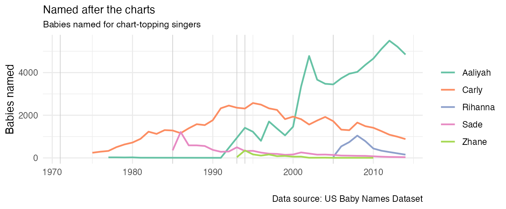

This table lists the screen characters whose first name surged in babies
after the title appeared. It shows the same effect from television and
film, with names like Meadow after The Sopranos and Imani after Coming
to America arriving within a year or two of release.

``` r
hbo %>% slice_max(Ratio, n = 8) %>%
    transmute(Name, Title = title, Released = release_year, Score = tmdb_score, Peak = Post, `Times bigger` = Ratio) %>%
    kable(caption = "Screen characters whose first name surged in babies after the title appeared")
```

| Name    | Title                              | Released | Score | Peak | Times bigger |
|:-------|:------------------------------|--------:|------:|-----:|------------:|
| Whitley | A Different World                  |     1987 |   6.7 |  484 |        484.0 |
| Zaria   | The Parent ’Hood                   |     1995 |   6.4 |  444 |        444.0 |
| Meadow  | The Sopranos                       |     1999 |   8.5 |  270 |        270.0 |
| Zander  | Starship Troopers                  |     1997 |   7.0 |  236 |        236.0 |
| Lyric   | Jason’s Lyric                      |     1994 |   6.6 |  385 |         64.2 |
| Justice | The Pelican Brief                  |     1993 |   6.6 | 1634 |         29.5 |
| Imani   | Coming to America                  |     1988 |   6.8 |  394 |         28.1 |
| Gage    | Tales from the Darkside: The Movie |     1990 |   6.1 | 1272 |         25.6 |

Screen characters whose first name surged in babies after the title
appeared

Plotting the character names from 1980 with a marker on each title’s
release does the same for screen. It shows the same short lag, with the
names rising within a year or two of the title.

``` r
plot_trajectories(tot, hbo_events$Name, events = hbo_events, from = 1980,
                  title = "Named after the screen", subtitle = "Babies named for popular screen characters")
```

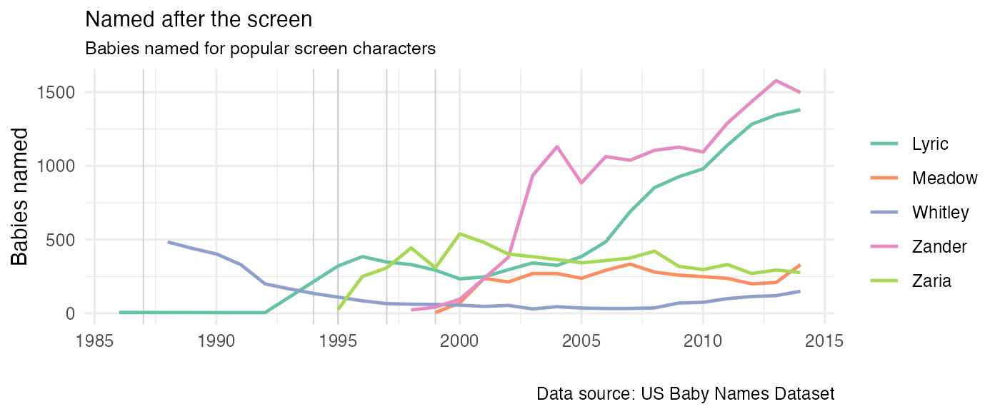

Pooling every matched name on the year its trigger landed and averaging
around it gives the event study that closes the question. Naming sits
flat before the trigger and jumps in the years just after, the cleanest
single piece of evidence that culture moves names.

``` r
plot_event_study(tot, ev_events)
```

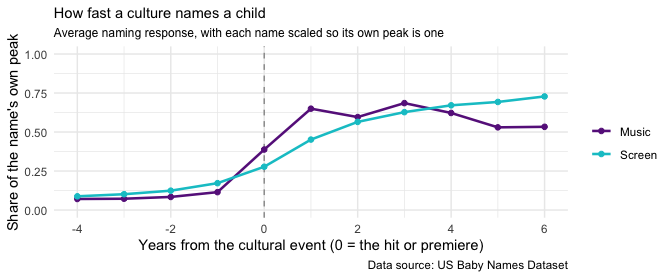

# Question 3, Loans and Credit

What drives default across a million anonymised Lending Club loans.
Default is defined as a loan charged off against one fully paid, and the
analysis stays descriptive, reading default rates across the factors the
Institute cares about. The data is large, so this chunk is cached.

My approach starts with what default means, so I resolve each loan to
charged off against fully paid and drop the unresolved cases, which
`load_loans` and `prep_default` handle. From there the work stays
descriptive rather than modelled, reading the default rate across the
factors the Institute named, with `plot_grade`, `plot_dti` and
`plot_states` covering the lender’s own grade, the debt-to-income lever
and the geographic claim about Texas. The aim is to test the agency’s
beliefs against the data rather than to build a classifier.

``` r
list.files('Question3/code/', full.names = T, recursive = T) %>% .[grepl('.R', .)] %>% as.list() %>% walk(~source(.))

loans <- load_loans("Question3/data/Loan_Cred/loan_data.rds") %>% # the one-million-row extract
    prep_default()# resolved loans with the default flag

sp <- function(tab) round(diff(range(tab$Default)), 1) # pp spread of a summary
bandit <- function(x, b, l) cut(x, b, labels = l) # quick banding helper

drivers <- tibble(# one row per factor, ranked by its spread
  Driver = c("Credit grade","Interest rate","Loan term","Debt-to-income",
             "Recent inquiries","Revolving use","Home ownership","Employment length","Public records"),
  Spread = c( # for each factor, the gap in default rate between its safest and riskiest band
    sp(default_rate(loans, grade)),  # grade A through G, grouped directly
    sp(default_rate(mutate(loans,# interest rate has to be banded into a category first
                           b = bandit(int_rate, c(0,10,15,20,100), c("<10","10-15","15-20","20+"))), b)),  # cut int_rate into four bands, then default rate per band
    sp(default_rate(loans, term)), # 36 vs 60 month term, grouped directly
    sp(default_rate(filter(loans, # drop the loans with no usable dti first
                           !is.na(dti)) %>%
                        mutate(b = bandit(dti, c(0,10,20,30,60), c("0-10","10-20","20-30","30+"))), b)), # band dti, then default rate per band
    sp(default_rate(mutate(loans, b = bandit(inq_last_6mths, c(-1,0,1,2,99), c("0","1","2","3+"))), b)),  # recent credit inquiries banded 0/1/2/3+
    sp(default_rate(mutate(loans, b = bandit(revol_util, c(-1,25,50,75,1000), c("<25","25-50","50-75","75+"))), b)), # revolving-credit use banded into quarters
    sp(default_rate(loans, home_ownership)), # own / mortgage / rent, grouped directly
    sp(default_rate(loans, emp_length)), # employment-length category, grouped directly
    sp(default_rate(mutate(loans, b = bandit(pub_rec, c(-1,0,99), c("0","1+"))), b)))) %>% # public records collapsed to none vs any
  arrange(desc(Spread)) # biggest spread first, so the strongest driver sits at the top

natg  <- loans %>% 
    group_by(grade) %>% 
    summarise(g = mean(default), .groups = "drop")

state <- loans %>% 
    left_join(natg, by = "grade") %>% 
    group_by(addr_state) %>% # observed vs grade-mix expectation
    summarise(Observed = round(mean(default) * 100, 1), Expected = round(mean(g) * 100, 1),
              Loans = n(), .groups = "drop") %>%
    filter(Loans >= 500) %>% 
    mutate(Excess = round(Observed - Expected, 1))

dti_band <- loans %>% filter(!is.na(dti)) %>% # default rate by debt-to-income band
    mutate(band = cut(dti, c(0,10,15,20,25,30,35,40,60), right = FALSE,
                      labels = c("0-10","10-15","15-20","20-25","25-30","30-35","35-40","40+"))) %>%
    group_by(band) %>% 
    summarise(Default = round(mean(default) * 100, 1), .groups = "drop")

cap_for  <- function(tol){ ok <- dti_band$band[dti_band$Default <= tol]
    edges <- c("0-10"=10,"10-15"=15,"15-20"=20,"20-25"=25,"25-30"=30,"30-35"=35,"35-40"=40,"40+"=60)
    if(length(ok)) unname(edges[as.character(tail(ok, 1))]) else NA } # upper edge of the highest safe band
cap_tab  <- tibble(`Default tolerance` = c("18%","20%","22%","25%"),
                   `DTI cap` = c(cap_for(18), cap_for(20), cap_for(22), cap_for(25)))
```

Default is read off against the grade the lender already assigns, from A
through G. It climbs without a single reversal, from about seven percent
at grade A to nearly sixty percent at grade G, a spread that dwarfs
every other factor in the data.

``` r
plot_grade(loans)
```

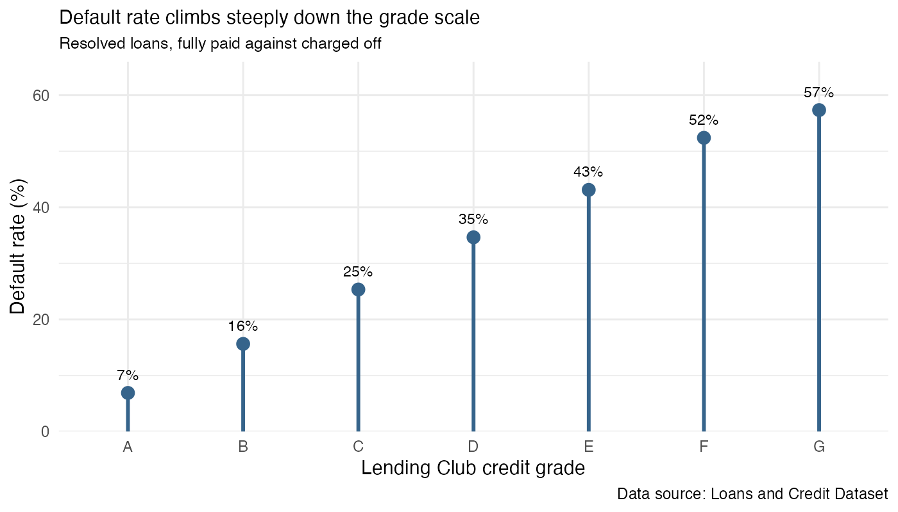

Ranking every factor by the gap between its safest and riskiest band
puts that dominance in one place. Grade tops the list by a wide margin,
and the things the Institute worried about, ownership and employment
among them, sit far down it.

``` r
drivers %>% 
    kable(caption = "Risk drivers ranked by the gap in default rate between their safest and riskiest band")
```

| Driver            | Spread |
|:------------------|-------:|
| Credit grade      |   50.5 |
| Interest rate     |   34.7 |
| Recent inquiries  |   32.6 |
| Loan term         |   15.4 |
| Debt-to-income    |   15.0 |
| Employment length |    9.4 |
| Revolving use     |    8.9 |
| Home ownership    |    8.3 |
| Public records    |    3.8 |

Risk drivers ranked by the gap in default rate between their safest and
riskiest band

Laying the default rate out in every grade and debt-to-income cell puts
the two strongest factors on one canvas. Reading down the grade axis
moves default far more than reading across the debt axis, so grade keeps
doing most of the sorting inside any debt band.

``` r
plot_grade_dti_heat(loans)
```

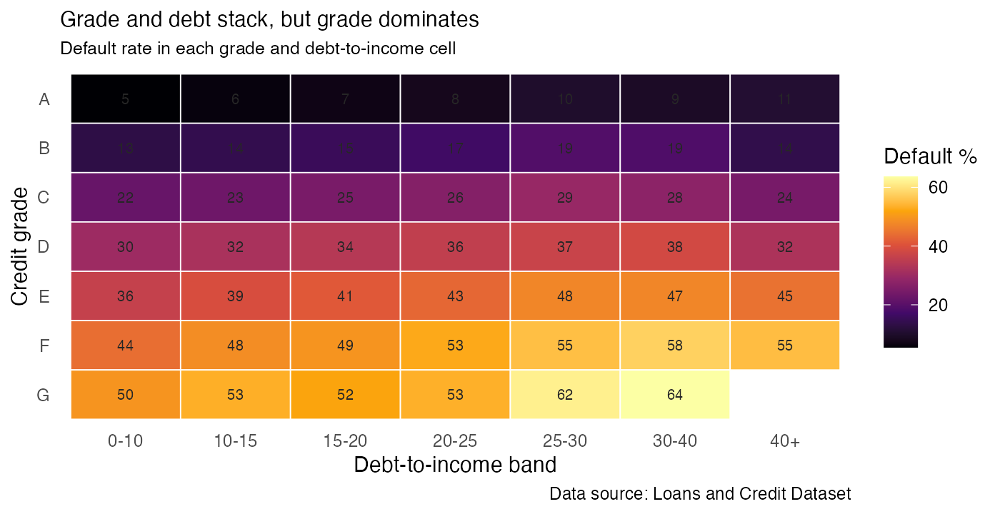

The next view reads the default rate across bands of the debt-to-income
ratio. Default rises smoothly as the ratio grows rather than breaking at
any threshold, so where to draw the cap is a tolerance call rather than
a natural line.

``` r
plot_dti(loans)
```

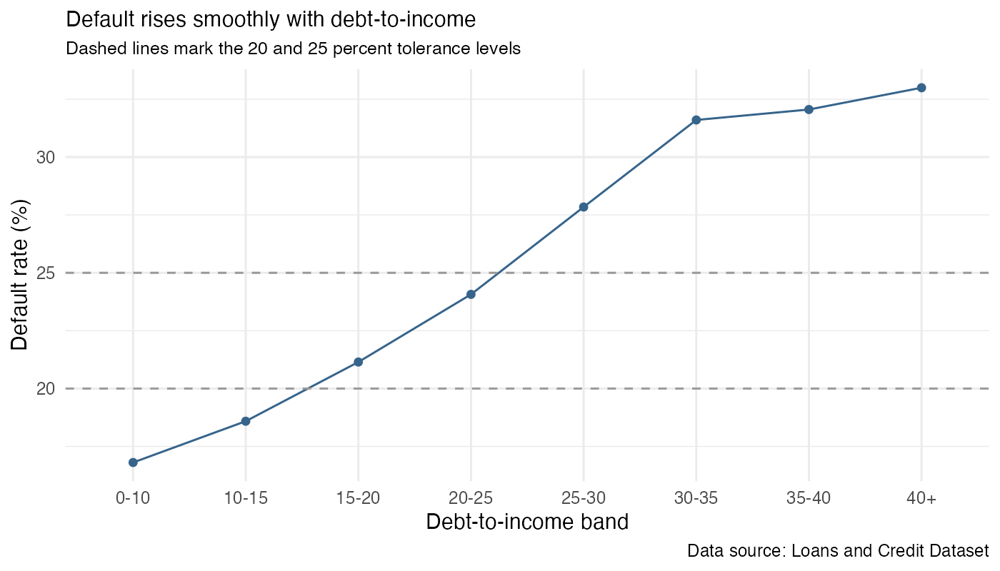

Turning that curve into a decision, this reads off the highest
debt-to-income band that still clears each default tolerance. A stricter
ceiling buys a lower cap, and no single value stands out as the obvious
place to cut.

``` r
cap_tab %>% kable(caption = "The highest debt-to-income band that still clears each default tolerance")
```

| Default tolerance | DTI cap |
|:------------------|--------:|
| 18%               |      10 |
| 20%               |      15 |
| 22%               |      20 |
| 25%               |      25 |

The highest debt-to-income band that still clears each default tolerance

Drawing the interest rate as a violin within each grade, with a boxplot
inside, shows the spread rather than just the average. The bands step
cleanly up the scale with little overlap, so a loan’s grade fixes its
price to a narrow range and the rate adds almost nothing as a separate
signal.

``` r
plot_rate_violin(loans)
```

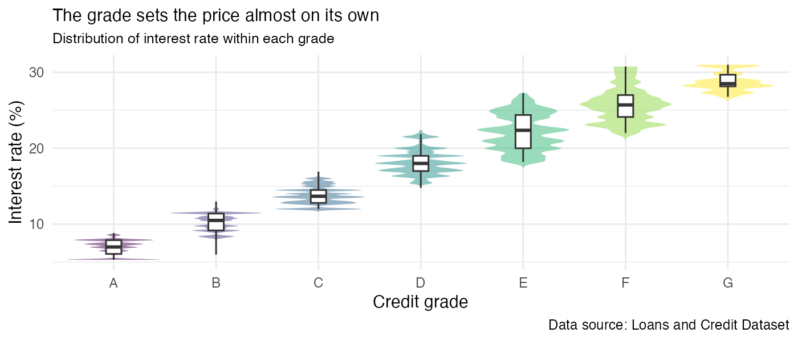

Each state’s actual default rate is set beside what its grade mix alone
would predict. Most of the gap between states turns out to be grade
composition, and Texas in particular lands almost exactly on the
national average rather than standing apart.

``` r
plot_states(loans)
```

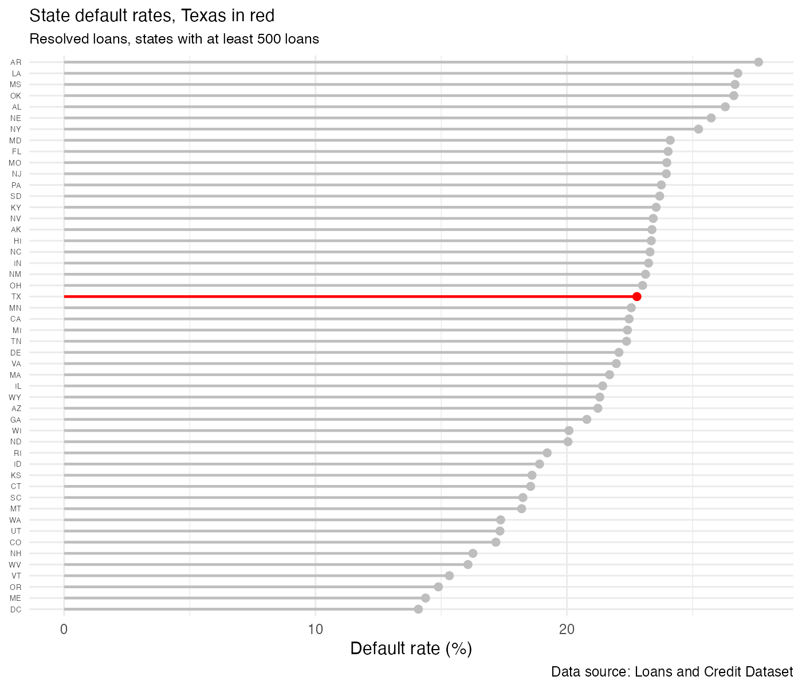

Listing the states with the largest excess default in either direction,
with Texas set alongside, separates real geography from grade mix. The
extremes are modest once grade is accounted for, and Texas carries
almost no excess at all.

``` r
bind_rows(slice_max(state, Excess, n = 4), slice_min(state, Excess, n = 4), filter(state, addr_state == "TX")) %>%
    distinct() %>% arrange(desc(Excess)) %>%
    kable(col.names = c("State", "Observed %", "Expected %", "Loans", "Excess pp"),
          caption = "States with the largest positive and negative excess default, with Texas for reference")
```

| State | Observed % | Expected % | Loans | Excess pp |
|:------|-----------:|-----------:|------:|----------:|
| LA    |       26.8 |       22.7 |  4187 |       4.1 |
| AR    |       27.6 |       23.6 |  2860 |       4.0 |
| OK    |       26.6 |       22.9 |  3570 |       3.7 |
| MS    |       26.7 |       23.5 |  2402 |       3.2 |
| TX    |       22.8 |       22.4 | 32383 |       0.4 |
| DC    |       14.1 |       20.1 |   880 |      -6.0 |
| VT    |       15.3 |       22.0 |   770 |      -6.7 |
| OR    |       14.9 |       21.8 |  4366 |      -6.9 |
| ME    |       14.4 |       21.8 |  1259 |      -7.4 |

States with the largest positive and negative excess default, with Texas
for reference

Fitting a logistic regression of default on the debt-to-income ratio,
run separately for each term, lets the model draw the risk curve rather
than a set of bars. Default climbs steadily with debt under both terms,
and the sixty-month curve sits above the thirty-six-month one the whole
way, so term and debt compound.

``` r
plot_dti_logit(loans)
```

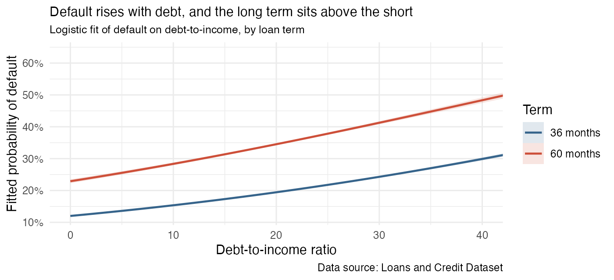

# Question 4, Netflix

A read on the Netflix catalogue for a team planning its own streaming
service. The functions parse the genres and countries, then map where
the films come from, what each country makes, how they rate and how long
they run, with HBO as a benchmark.

My approach parses the data before reading anything from it, so
`load_streaming` pulls genre and country out of the raw text fields and
`prep_movies` keeps films up to 2022. The plots then read the catalogue
from a few angles, where titles come from, what each country specialises
in, how acclaim and popularity diverge and how long films run, and
`plot_hbo` sets all of it against HBO as a benchmark.
`distinctive_words` cross-checks the genre map against the language of
the descriptions so the picture does not rest on the genre tags alone.

``` r
list.files('Question4/code/', full.names = T, recursive = T) %>% .[grepl('.R', .)] %>% as.list() %>% walk(~source(.))

titles <- load_streaming("Question4/data/netflix/titles.rds") # IMDb-sourced titles

movies <- prep_movies(titles) # films up to 2022

hbo <- load_streaming("Question4/data/HBO_titles.rds") %>% 
    filter(type == "MOVIE") # HBO films

topc <- movies %>% 
    unnest(country) %>% 
    count(country, sort = TRUE) %>% 
    slice_head(n = 8) %>% 
    pull(country)

topg <- movies %>% 
    unnest(genre) %>% 
    count(genre, sort = TRUE) %>%
    slice_head(n = 8) %>% 
    pull(genre)

content_g <- c("drama","comedy","thriller","romance","action","documentation","crime")

credits <- load_credits("Question4/data/netflix/credits.rds")# cast and crew, one row per person per title
mvcsv   <- load_movies_csv("Question4/data/netflix/netflix_movies.csv")# classic export, carries the age rating
age_tab <- mvcsv %>% filter(type == "Movie") %>% # six most common age ratings among films
    count(rating, name = "Films") %>% slice_max(Films, n = 6, with_ties = FALSE)
```

This plot compares the contents of the Netflix catalogue, showing that
films far outpace shows on the platform.

``` r
plot_catalogue(titles)
```

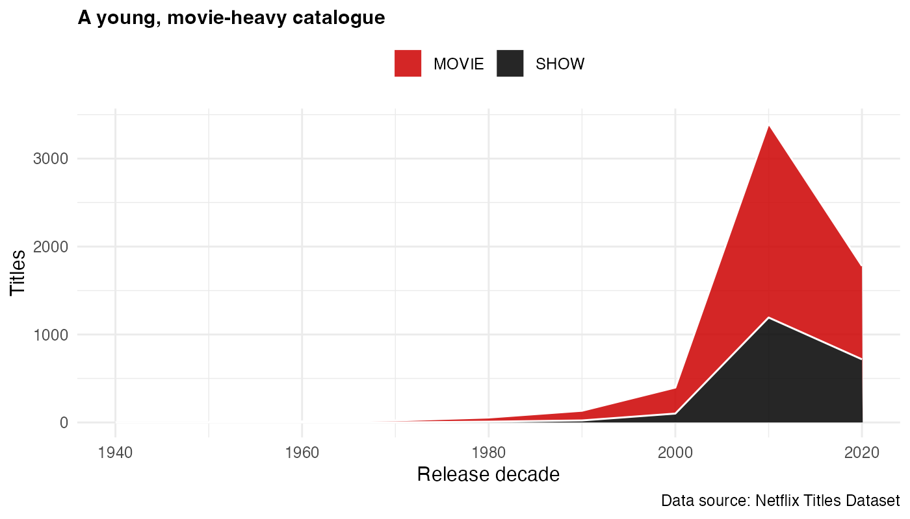

Ranking the production countries by how many films each puts into the
catalogue maps its centre of gravity. The library is American at its
core but far from American alone, with India a clear second.

``` r
plot_countries(movies, 10)
```

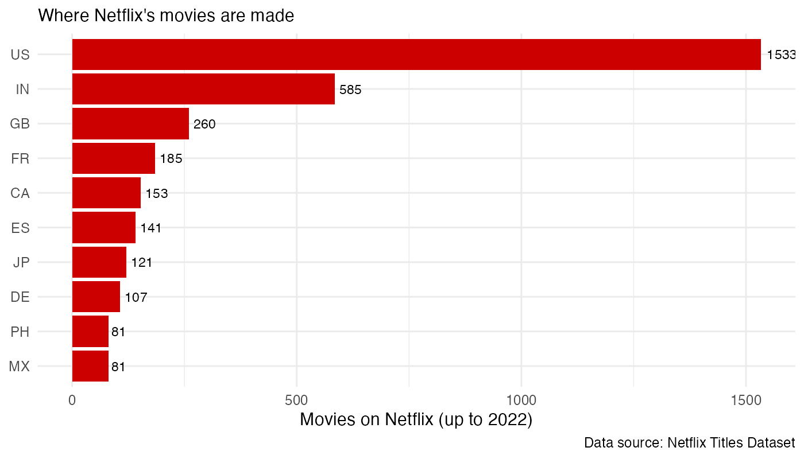

This plot gives the share of each country’s films that falls in each
major genre. It shows that every tradition specialises differently, with
India leaning on drama and romance, Japan on action, and the United
States and Britain on documentaries.

``` r
plot_genre_country(movies, topc, topg)
```

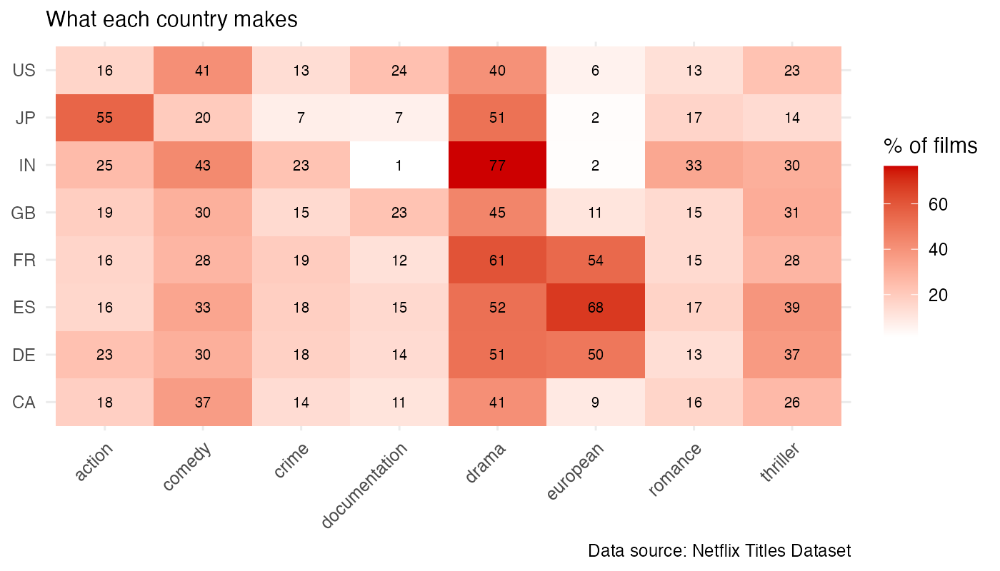

Reading each cell as the chance that a film with the row genre also
carries the column genre, with the diagonal fixed at one, shows how
genres combine rather than just how common they are. Drama is the hub,
with close to three in four romances and about two in three crime and
thriller films also tagged drama, so a drama base quietly underwrites
most of the catalogue.

``` r
plot_genre_cooccur(movies, content_g)
```

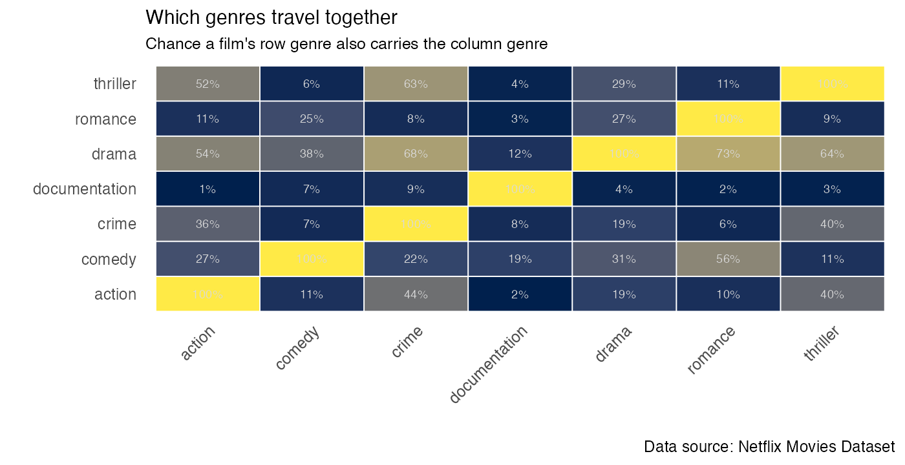

Each genre is placed by its typical critic score against its typical
audience size. Acclaim and popularity pull apart here, with
documentaries rating highly on small audiences and thrillers doing the
reverse, and that split is the most useful signal for a new entrant.

``` r
plot_ratings(movies, topg)
```

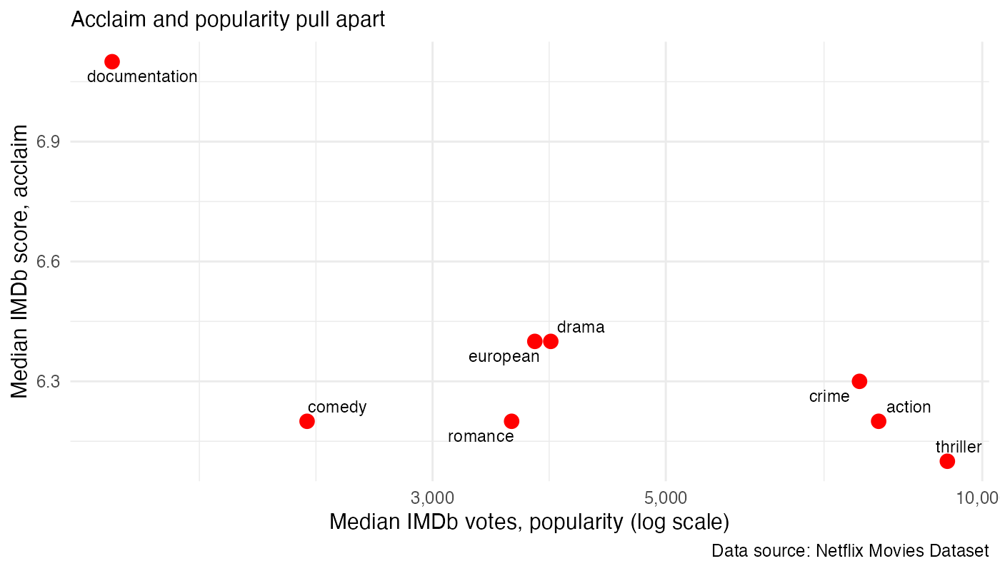

Binning every film by its score against its audience size, with a fitted
line through the cloud, shows where the catalogue really sits rather
than where the genre medians do. At the film level the tilt is gently
positive, a correlation near 0.21, so a more-watched film rates slightly
higher even though the genre medians pull apart.

``` r
plot_score_hex(movies)
```

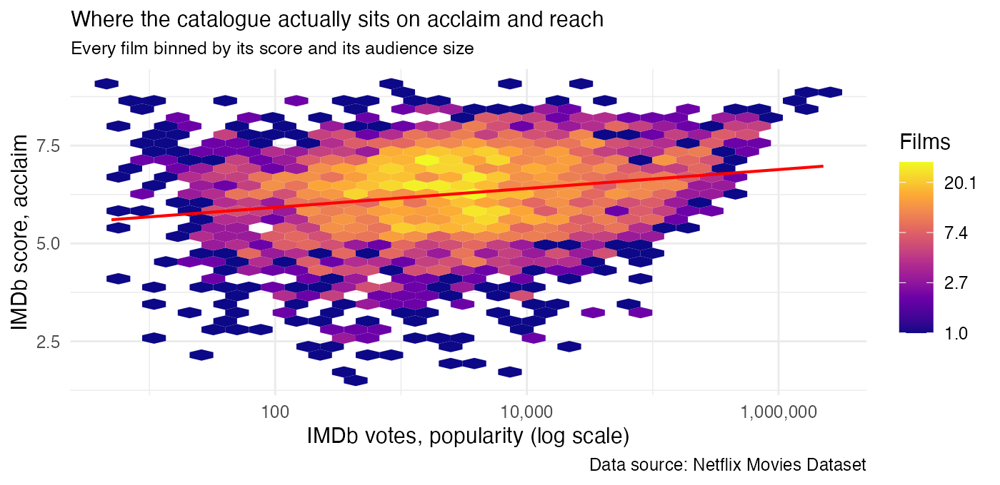

Running time, compared across production countries, turns out to carry a
signature of its own. Indian films run far longer than the American
median, a difference clear enough to read off the chart.

``` r
plot_length(movies, topc)
```

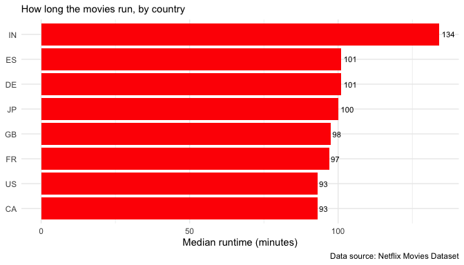

Drawing each major producer’s runtime distribution as a ridge, ordered
by typical length, turns the median figures into full shapes. The Indian
films sit visibly to the right of the American ones rather than just
averaging higher, so the longer film is the rule across that tradition
and not a handful of outliers.

``` r
plot_runtime_ridges(movies, topc)
```

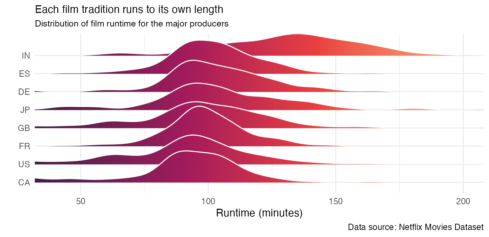

Setting the typical Netflix score against HBO within each genre gives a
like-for-like benchmark. Netflix trades quality for breadth, rating
below HBO in every genre rather than only on the overall average.

``` r
plot_hbo(movies, hbo, content_g)
```

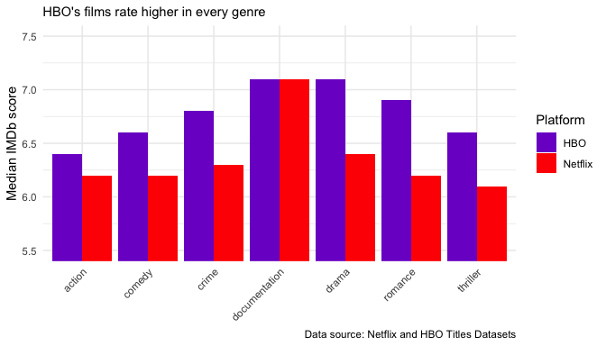

This table lists the words most distinctive to each genre’s
descriptions, measured by how much more they appear there than
elsewhere. It shows that each genre reaches for its own vocabulary,
which confirms the genre map from the language up rather than from the
tags alone.

``` r
distinctive_words(movies, content_g) %>%
    group_by(genre) %>%
    summarise(`Distinctive words` = str_c(word, collapse = ", "), .groups = "drop") %>%
    kable()
```

| genre | Distinctive words |
|:-------------|:---------------------------------------------------------|
| action | naruto, assassin, mankind, lord, policeman, hero |
| comedy | hilariously, jokes, laughs, parenting, jeff, riffs |
| crime | serial, heist, criminals, investigation, lord, officers |
| documentation | documentary, unprecedented, interviews, footage, legacy, intimate |
| drama | biopic, aftermath, navigates, tensions, tested, ailing |
| romance | romantic, handsome, crush, romance, chef, marry |
| thriller | suspects, thriller, investigating, kills, heist, killers |

The people behind the films echo that country map. Counting the actors
who appear on the most in-scope titles puts Indian cinema firmly on top,
which is a large part of why India sits so high in the catalogue.

``` r
top_actors(credits, movies, 8) %>%
    kable(caption = "Actors credited on the most Netflix films up to 2022")
```

| name                  | Films |
|:----------------------|------:|
| Shah Rukh Khan        |    30 |
| Boman Irani           |    25 |
| Kareena Kapoor Khan   |    25 |
| Anupam Kher           |    24 |
| Paresh Rawal          |    22 |
| Nawazuddin Siddiqui   |    20 |
| Priyanka Chopra Jonas |    20 |
| Amitabh Bachchan      |    19 |

Actors credited on the most Netflix films up to 2022

The catalogue also skews mature rather than family. Tallying the age
ratings in the classic export, the certificate that comes up most often
by a clear margin is TV-MA, so adult-oriented content is where the
volume sits.

``` r
age_tab %>% rename(`Age rating` = rating) %>%
    kable(caption = "Most common age ratings among Netflix films, from the classic catalogue export")
```

| Age rating | Films |
|:-----------|------:|
| TV-MA      |  2062 |
| TV-14      |  1427 |
| R          |   797 |
| TV-PG      |   540 |
| PG-13      |   490 |
| PG         |   287 |

Most common age ratings among Netflix films, from the classic catalogue
export
